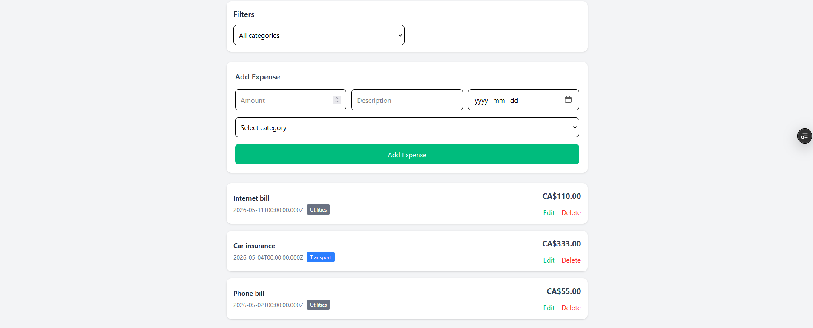
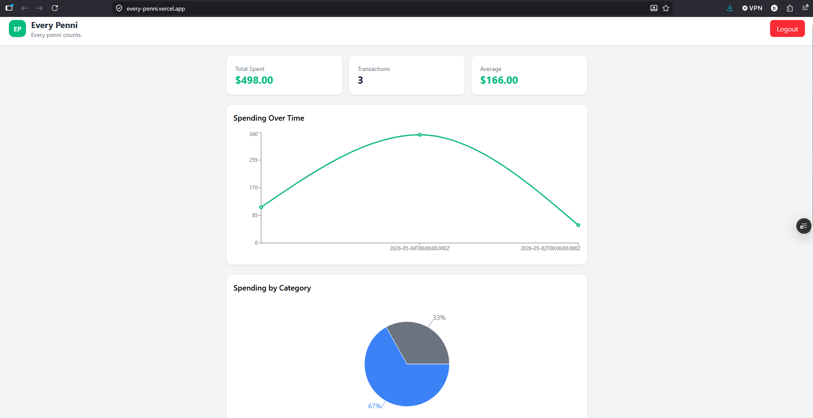

# Every Penni

A full-stack personal finance tracking application built to help users manage expenses, visualize spending habits, and organize transactions by category.

## Live Demo

🚀 [https://every-penni.vercel.app/](https://every-penni.vercel.app/)

## GitHub Repository

🔗 [https://github.com/darojasrm/Every-Penni](https://github.com/darojasrm/Every-Penni)

---

# Features

- 🔐 JWT Authentication
- 📊 Expense analytics dashboard
- 🥧 Category-based pie charts
- 📈 Spending trends visualization
- 🏷️ Expense categories with color badges
- 🔎 Category filtering
- ✏️ Edit and delete expenses
- 📱 Responsive mobile-first design
- ☁️ Full production deployment

---

# Tech Stack

## Frontend

- React
- Vite
- Tailwind CSS
- Recharts
- Context API

## Backend

- Node.js
- Express
- JWT Authentication
- PostgreSQL

## Database & Deployment

- Neon PostgreSQL
- Render
- Vercel

---

# Screenshots

## Authentication


## Dashboard



## Charts & Analytics



## Mobile View


---

# Project Structure

```text
Every-Penni/
├── backend/
├── frontend/
├── db/
├── screenshots/
├── README.md
└── .gitignore
```

---

# Local Development Setup

## 1. Clone the repository

```bash
git clone https://github.com/darojasrm/Every-Penni.git
```

---

## 2. Backend setup

```bash
cd backend
npm install
```

Create a `.env` file inside `backend/`:

```env
DATABASE_URL=your_database_url
JWT_SECRET=your_jwt_secret
PORT=3000
```

Start backend:

```bash
npm start
```

---

## 3. Frontend setup

```bash
cd frontend
npm install
```

Create a `.env.local` file inside `frontend/`:

```env
VITE_API_URL=http://localhost:3000
```

Start frontend:

```bash
npm run dev
```

---

# Database Setup

Run the SQL files inside the `db/` folder in this order:

1. `schema.sql`
2. `seed.sql`

---

# Future Improvements

- 📅 Date range filtering
- 💰 Budget tracking system
- 📤 CSV export
- 🧠 Smart spending insights
- 🌙 Dark mode
- 📥 Recurring expenses

---

# Author

Created by Daniel Rojas Barco.
